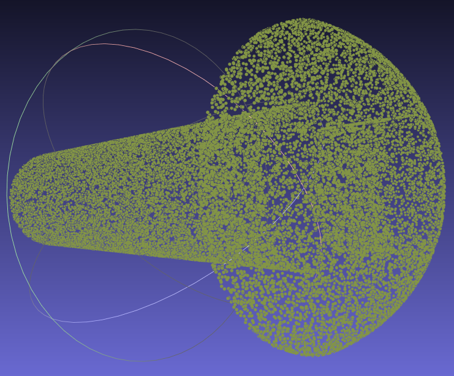
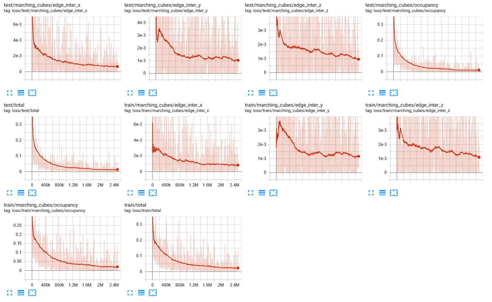
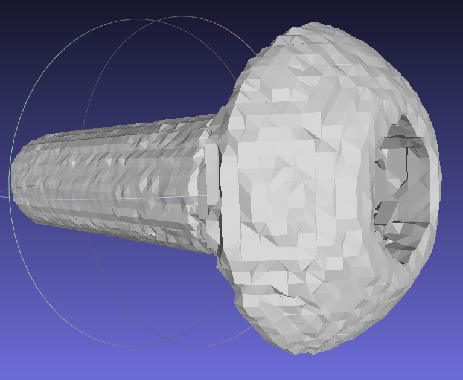

# Modeling Course: Reconstruction
Based on [PPSurf](https://www.cg.tuwien.ac.at/research/publications/2024/erler_2024_ppsurf/), a neural network that estimates a inside/outside probability from point clouds. This essentially creates a truncated signed distance function, which is turned into a mesh with Marching Cubes.

Try our live system on [Huggingface](https://huggingface.co/spaces/perler/ppsurf).

In this assignment, you will:
1. generate parts of the dataset.
1. train a neural network for reconstruction on this data.
1. evaluate the results of different loss functions.
1. write a short report about your solutions and results.

## Setup

You may use this [Google Colab notebook](https://colab.research.google.com/drive/1558rCsz7N1L7xsmnbaI6TX8XGUwLQwBP?usp=sharing) instead of a local setup. The free T4 runtime is sufficient but rather slow with approx. 30 min per epoch.

We tested the following setup: 
- Windows 10/11 (Linux should work as well)
- Python 3.12 or Python 3.11.9
- CUDA 12.4
- Package manager and virtual environment: [Pipenv](https://pipenv.pypa.io/en/latest/) 
- IDE and Markdown Viewer: [PyCharm](https://www.jetbrains.com/pycharm/) or [Visual Code](https://code.visualstudio.com/download)
- Mesh and Point Cloud Viewer: [Meshlab](https://www.meshlab.net/)

If you are familiar with other dependency managers and IDEs (e.g. Eclipse), feel free to deviate from these instructions. In the end, only your code and the results count. Note: Pytorch dropped conda support and Pytorch-lightning / Pytorch-geometric don't support Pipenv.

1. Install [PyCharm](https://www.jetbrains.com/pycharm/)
   1. Open this directory in PyCharm (folder, not just a file)
   1. PyCharm will open this Readme with Markdown rendering.
1. Install [Python **3.12** 64 bit](https://www.python.org/downloads/). Do NOT install Python 3.13 since some packages do not support it yet.
1. Create the virtual environment with: `python -m venv .venv`
1. Activate the virtual environment in a terminal with a matching script in `.venv\Scripts\`
   1. Windows Powershell: Run `.venv\Scripts\Activate.ps1`. If it refuses to execute scripts, you'll need to change a setting via PS with admin rights: [Enable script execution via PS with admin rights](https://learn.microsoft.com/en-us/powershell/module/microsoft.powershell.core/about/about_execution_policies?view=powershell-7.5): `Set-ExecutionPolicy -ExecutionPolicy RemoteSigned -Scope CurrentUser`. 
   1. Windows CMD: Run `.venv\Scripts\activate.bat`
   1. Linux: Run `.venv\Scripts\activate`
1. Install all necessary dependencies with: `pip install -r requirements.txt`

If you use *PyCharm*, setup the interpreter:
1. Click on "\<No interpreter\>" in the lower right corner
1. Click on "Add New Interpreter" -> "Add Local Interpreter..."
1. Select the `python.exe` (python binary in Linux)  in `.venv` as interpreter. The easiest way is when the "Generate New" tab (with Virtualenv type) tells you that `.venv` already exists and suggest to use it with "select existing interpreter".
1. You should see "Python 3.12 virtualenv at [PATH]\ppsurf_modeling\.venv" in the lower right corner now.

If you use *VS Code*, we recomend to install the [Python Environment Manager](https://marketplace.visualstudio.com/items?itemName=donjayamanne.python-environment-manager). You will then find the environment under `Workspace Envs` and can set it as the active workspace interpreter.

## Tasks

### Task 1 (5 Points): Data Normalization

The dataset generation is run in a multi-processing framework. You can still debug the processing steps like normal code. Any unhandled errors will stop the system and print the stack traces in the console. You can set the number of worker processes in the `worker_processes` parameter in `make_dataset.py`. To start the dataset generation, open the `make_dataset.py` and start it (PyCharm defaults: F5 for debugging, Shift+F5 for run without debugger; then select a python file). You can always get debug outputs of Trimesh meshes with `mesh.export('debug.ply')`. This also works in the watch window while debugging. The framework skips processing steps when the outputs exist and are up-to-date. Therefore, you need to clean output directories manually after changing the relevant code. Further, you will encounter error messages of tasks that you didn't tackle yet.

You can find the dataset files in `datasets/abc_modeling_course/*` and verify them manually. Here is a short explanation:
1. `00_base_meshes`: raw input files from the [ABC dataset](https://archive.nyu.edu/handle/2451/43778)
2. `01_base_meshes_ply`: meshes converted to PLY
2. `02_meshes_cleaned`: broken meshes are fixed (if possible) or removed
2. **`03_meshes`: normalized meshes that are used for training and evaluation, outputs of Task 1**
2. **`04_pts`: point clouds, as Numpy files, outputs of Task 2**
2. **`04_pts_vis`: point clouds, as text files (drag&drop into Meshlab), outputs of Task 2**
2. `05_patch_vis`: optional visualizations of the training samples
2. `05_query_pts`: query points for training the SDF, as Numpy files
2. `05_query_dist`: signed distances for the corresponding query points, as Numpy files
2. `06_splits`: dataset splits for training and test / evaluation set, as text files
1. `settings.ini`: settings for this dataset generation

Deep Learning and other ML techniques work best when the input data is normalized. In the context of reconstruction, we need to normalize the input meshes to unit cube size.

1. **Modify the marked code lines in [source/framework/make_dataset/scale_mesh.py](source/framework/make_dataset/scale_mesh.py). The bounding box of output mesh must be in [-0.5...+0.5]^3.**
   1. The output mesh must not be distorted, i.e. use only translation and uniform scaling. 
   2. Use vectorization of NumPy arrays. Do not iterate over the vertices.
2. **Describe the transformation steps and their order in the report. You will find the meshes as .ply in [datasets/abc_modeling_course/03_meshes](datasets/abc_modeling/03_meshes). You can check the correct scaling by opening them in Meshlab and using the measure tool.**

You should get a scaled mesh like this:

### Task 2 (7 Points): Point Cloud Sampling

For this supervised training, we generate a point cloud from a mesh dataset. This way, we have a ground-truth mesh we can compare the reconstruction to.

1. **Modify the marked code lines in [source/framework/make_dataset/sample_surface.py](source/framework/make_dataset/sample_surface.py).** For each sample:
   1. select a random face of the mesh. The face probability must be proportional to its size. You may use Trimesh's face area calculation (`mesh.area_faces` property).
   2. calculate a uniformly distributed random position on the selected face.
   3. Use the given seed for a random number generator (NumPy recommended).
   4. Use vectorization of NumPy arrays. Do NOT iterate over the faces.
   5. Do NOT use the functions in Trimesh's sample module.
2. **Run the [make_dataset.py](make_dataset.py) to create the dataset for the next task. Outputs are created in `datasets/abc_modeling_course/`.**
3. **Describe the sampling process and show some results in your report. You will find the point clouds as .xyz `datasets/abc_modeling_course/04_pts_vis`. Use screenshots of these objects (e.g. opened in Meshlab) for your report.**

You should get a point cloud like this:

### Task 3 (13 Points): Train and Evaluate the Network

#### Training

Run [pps_modeling.py](pps_modeling.py) to train and evaluate the network. The full training takes around 15 minutes on an RTX 3070 TI and 16GB RAM.

You can change hyperparameters in [configs/pps_modeling.yaml](configs/pps_modeling.yaml) or overwrite them in [pps_modeling.py](pps_modeling.py). The most important ones are:
- `trainer.accelerator`: Set to "CPU" if you don't have a supported GPU. Expect around 10x longer training times.
- `data.batch_size`: Reduce if you run out of GPU memory. Note: Pytorch usually fills almost the whole GPU memory, no matter how much it actually needs. Reducing the batch size will hurt convergence, so you should increase the number of epochs. If your system is using shared memory (check task manager), training will be significantly slower.
- `data.workers`: Number of workers for data loading. Reduce if you run out of RAM or get a paging file error. Set to `0` for faster debugging on Windows.

While training, only a minimal loss information is printed in the console. Additional loss curves and metrics can be seen via Tensorboard:
1. Start Tensorboard server with `start_tensorboard.bat` (Windows) or `start_tensorboard.sh` (Linux).
2. Open http://localhost:6006/ in a browser. Use these curves for your report. You should see curves like these:

#### Evaluation

After each run, you should copy the model (models) and results into a backup folder. Otherwise, they will be overwritten. Alternatively, you can change the model_name variable in [pps_modeling.py](pps_modeling.py). If you want to run only parts of the pipeline, e.g. evaluation without re-training, comment out the unwanted blocks in [pps_modeling.py](pps_modeling.py). 

The models and loss logs will be saved in `models`. Reconstruction and evaluation outputs will be created in `results/[model_name]/[dataset_name]/`. The `meshes` directory, `chamfer_distance.xlsx`, `normal_error.xlsx`, and `f1.xlsx` are the most interesting outputs. Use those for your report. Note that some metrics are not deterministic and may vary by up to +-5%.

You should get a reconstruction like this:

#### Report

1. **Run the training and evaluation with the default setup and note. Report**
   1. all the changes you made. 
   2. mean Chamfer distance and F1-Scores from the result XLSX.
   3. training and validation loss curves. 
2. **In supervised training, a loss function computes the error between the prediction and the ground-truth (GT) data. A minor change can cause huge differences in accuracy. Change the loss function in [source/poco_model.py](source/poco_model.py) to something else. Implement your own loss function or try one of [Pytorch](https://pytorch.org/docs/stable/nn.html#loss-functions). Re-train and evaluate the results. Report the differences and explain why you chose this loss function.**

### Bonus Task Noise (3 Bonus Points)

To get a more realistic dataset, we want to simulate scanner noise. An easy solution is to extend the point sampling method (Task 2) with a random offset in normal direction:
1. Backup your previous dataset and clean the `04_pts` and `04_pts_vis` directories.
1. Calculate normals for each face of the input mesh. You may use all of Trimesh's functions.
   1. For each point in the point cloud, find the closest face and get its normal vector. Use e.g. Trimesh's proximity functions or a SciPy kD-tree.
   3. Apply a random offset (with Gaussian distribution) along the normals to the points. Add a constant for the noise strength (1% of the bounding box as offset is already a lot).
4. Re-train and evaluate the network.
5. Explain your implementation and show the resulting changes in accuracy (with different noise strengths).

### Bonus Task Classic Reconstruction (3 Bonus Points)

Is data-driven reconstruction better than classic methods? Compare the results with a classic method like Poisson reconstruction, VCG, and Ball pivoting. You can use e.g. Meshlab manually or [scripted](https://pymeshlab.readthedocs.io/en/latest/) for this task. Note that Poisson Reconstruction requires point normals which you can either calculate with the dataset generation or estimate with a Meshlab filter.
Compare the quality and runtime of the chosen methods.

### Bonus Task Free Experimentation (X Bonus Points)

Want to try more loss functions? A different network architecture? More realistic noise simulation? A bigger, more/less specialized dataset? Another data augmentation variant?
Go for it! Send us a message (email or TUWEL) so we can discuss the scope and grading of your idea, and we likely can give some help.

## Report and Submission

Zip (any type 7zip can open) your code + dataset + results + report and submit it in TUWEL. Max. submission size is 256 MB. Name the report and archive like "0000000-lastname-firstname-A2" with "0000000" being your student number.

Submission contents:
1. **Code**: Include all code files.
1. **Dataset**: Include all files in the directories `03_meshes`, `04_pts_vis`, and `05_patch_vis` in `datasets/abc_modeling`.
1. **Results**: Include all relevant trainings in `results`.
1. **Report**: A PDF file named like the Zip. This report should contain:
   1. a list of tasks you have done (partially).
   2. a short description how you did the tasks.
   3. at least one normalized mesh with measurement (Meshlab) along the longest axis.
   4. at least three point clouds on top of the corresponding wireframe-mesh.
   5. a comparison for all training runs:
      1. the train/val loss curves and F1 metric curves from Tensorboard.
      2. Chamfer distance, F1, and Normal Error from the result XLSX.
      3. a few reconstructed meshes.

   
## Trouble Shooting

Pip might fail when creating the environment. If so, try installing the Pip packages from the `requirements.txt` manually. Reach out to us if you need further help.

On Windows, Pip install may raise this error:
'Microsoft Visual C++ 14.0 or greater is required. Get it with "Microsoft C++ Build Tools" error. 
In this case, install the MS Visual Studio build tools, as described on [Stackoverflow](https://stackoverflow.com/questions/64261546/how-to-solve-error-microsoft-visual-c-14-0-or-greater-is-required-when-inst).

Installing PySDF with Pip might fail with the error that `high_resolution_clock` is missing. See [MS STL](https://github.com/microsoft/STL/pull/5105) for more details. In this case:
1. [Download the package from PyPi](https://pypi.org/project/pysdf/#files)
2. Add `#include <chrono>` to `include/sdf/internal/sdf_util.hpp`
3. Re-zip the package and install it with `pip install <filename>.zip`.
