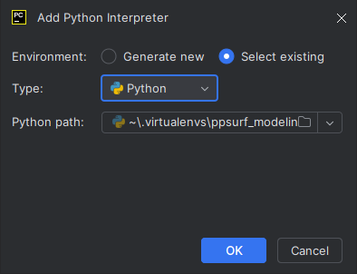

# Modeling Course: Reconstruction
Based on [PPSurf](https://www.cg.tuwien.ac.at/research/publications/2024/erler_2024_ppsurf/), a neural network that estimates a inside/outside probability from point clouds. This essentially creates a truncated signed distance function, which is turned into a mesh with Marching Cubes.

Try our live system on [Huggingface](https://huggingface.co/spaces/perler/ppsurf).


In this assignment, you will:
1. generate parts of the dataset.
1. train a neural network for reconstruction on this data.
1. evaluate the results of different loss functions.
1. write a short report about your solutions and results.


## Setup

We tested and recommend the following setup: 
- Windows 10/11 (Ubuntu should work as well)
- Python 3.12
- CUDA 12.4
- Package manager and virtual environment: [Pipenv](https://pipenv.pypa.io/en/latest/) 
- IDE and Markdown Viewer: [PyCharm](https://www.jetbrains.com/pycharm/)
- Mesh and Point Cloud Viewer: [Meshlab](https://www.meshlab.net/)

If you are familiar with other dependency managers (e.g. Conda) and IDEs (e.g. VS Code, Eclipse), feel free to deviate from these instructions. In the end, only your code and the results count.


1. Install [PyCharm](https://www.jetbrains.com/pycharm/)
   1. Open this directory in PyCharm (folder, not just a file)
   1. PyCharm will open this Readme with Markdown rendering.
1. Create the virtual environment with all necessary dependencies. Run this in a terminal in the repo root dir:
``` bash
pip install pipenv
pipenv install
pipenv shell
```
1. Setup PyCharm Python interpreter
   1. Click on "<No interpreter>" in the lower right corner
   2. Click on "Add New Interpreter" -> "Add Local Interpreter..."
   1. Go to Project: ... -> Python Interpreter
   2. In "Select existing", Type "Python", Python path scroll down and select: "~\.virtualenvs\ppsurf_modeling..."
   


1. When running a Python file, you may encounter File-not-found errors. In this case ensure that the working directory in the run configuration is set to the main directory containing this ReadMe.


## Tasks

### Task 1 (8 Points): Data Normalization

The dataset generation is run in a multi-processing framework. You can still debug the processing steps like normal code. Any unhandled errors will stop the system and print the stack traces in the console. You can set the number of worker processes in the `worker_processes` parameter in `make_dataset.py`. To start the dataset generation, open the `make_dataset.py` and start it (PyCharm defaults: F5 for debugging, Shift+F5 for run without debugger). You can always get debug outputs of Trimesh meshes with `mesh.export('debug.ply')`. This also works in the watch window while debugging. The framework skips processing steps when the outputs exist and are up-to-date. Therefore, you need to clean output directories manually after changing the relevant code. Further, you will encounter error messages of tasks that you didn't tackle yet.

You can find the dataset files in `datasets/abc_modeling_course/*` and verify them manually. Here is a short explanation:
1. `00_base_meshes`: raw input files from the [ABC dataset](https://archive.nyu.edu/handle/2451/43778)
2. `01_base_meshes_ply`: meshes converted to PLY
2. `02_meshes_cleaned`: broken meshes are fixed (if possible) or removed
2. **`03_meshes`: normalized meshes that are used for training and evaluation, outputs of Task 1**
2. **`04_pts`: point clouds, as Numpy files, outputs of Task 2**
2. **`04_pts_vis`: point clouds, as text files (drag&drop into Meshlab), outputs of Task 2**
2. `05_patch_vis`: optional visualizations of the training samples
2. `05_query_pts`: query points for training the SDF, as Numpy files
2. `05_query_dist`: signed distances for the corresponding query points, as Numpy files
2. `06_splits`: dataset splits for training and test / evaluation set, as text files
1. `settings.ini`: settings for this dataset generation

Deep Learning and other ML techniques work best when the input data is normalized. In the context of reconstruction, we need to normalize the input meshes to unit cube size.

1. Modify the marked code lines in [source/framework/make_dataset/scale_mesh.py](source/framework/make_dataset/scale_mesh.py). The bounding box of output mesh must be in [-0.5...+0.5], symmetric to the origin. 
   1. The output mesh must not be distorted, i.e. use only translation and uniform scaling. 
   1. Use vectorization of NumPy arrays. Do not iterate over the vertices.
1. Describe the transformation steps and their order in the report. You will find the meshes as .ply in [datasets/abc_modeling_course/03_meshes](datasets/abc_modeling_course/03_meshes). You can check the correct scaling by opening them in Meshlab and using the measure tool.

You should get a scaled mesh like this:


### Task 2 (7 Points): Point Cloud Sampling

For this supervised training, we generate a point cloud from a mesh dataset. This way, we have a ground-truth mesh we can compare the reconstruction to.

Modify the marked code lines in [source/framework/make_dataset/sample_surface.py](source/framework/make_dataset/sample_surface.py). 
1. For each sample:
   1. select a random face of the mesh. The face probability must be proportional to its size. You may use Trimesh's face area calculation (`mesh.area_faces` property).
   2. calculate a uniformly distributed random position on the selected face.
   3. Use the given seed for a random number generator (NumPy recommended).
   1. Use vectorization of NumPy arrays. Do not iterate over the faces.
   1. Do NOT use the functions in Trimesh's sample module.
1. Run the `make_dataset.py` to create the dataset for the next task. Outputs are created in `datasets/abc_modeling_course/`. The multi-threaded logging may print a BrokenPipeError in the end, which you can safely ignore.
1. Describe the sampling process and show some results in your report. You will find the point clouds as .xyz `datasets/abc_modeling_course/04_pts_vis`. Use screenshots of these objects (e.g. opened in Meshlab) for your report. For some reason, opening the .xyz files with Meshlab does not work but drag&drop from the explorer does.

You should get a point cloud like this:


### Task 3 (10 Points): Train and Evaluate the Network

The training uses PyTorch as backend. While training, only a minimal loss information is printed in the console. Additional loss curves and metrics can be seen via Tensorboard:
1. Open Anaconda Prompt (anaconda3) and cd to the main directory
1. Activate the virtual environment with "`conda activate p2s`"
1. Start Tensorboard server with "`tensorboard --logdir logs`"
1. Open http://localhost:6006/ in a browser. You should see curves like these (smoothing>=0.95):

Use these curves for your report.

Run `full_run.py` to train and evaluate the network. Train for at least 3, better 10 epochs, where each epoch takes around 5 minutes on a GTX 1070 TI.

**GPU out-of-memory**: If your GPU runs out of memory, decrease the `batch_size`. 

**RAM out-of-memory / paging file**: Decrease the number of workers if you run out of RAM or get a paging-file error. Usually, PyCharm will also offer you to increase the page-file size when it runs out of space. 

**Old GPU**: PyTorch dropped support for Compute Capability 3.5 in version 1.3.1. You may notice this issue by receiving the following error: "RuntimeError: CUDA error: no kernel image is available for execution on the device". Install the conda environment with the `p2s_cc35.yml` or modify your environment according to this file. We tested this with a Geforce 710. Additionally, you need to comment/uncomment two pairs of lines in `source/points_to_surf_train.py` marked with "# Older GPU, Pytorch<1.4" around line 500.

**No GPU**:  If you don't have a GPU with CUDA support, install the conda environment with the `p2s_cpu.yml` or modify your environment according to this file. Uncomment the three `gpu_idx` settings in `full_run.py`. Expect around 10x longer training times.

After each run, you should copy the model (models) and results into a backup folder. Otherwise, they will be overwritten. Alternatively, you can change the model_name variable. If you want to run only the evaluation without re-training, comment out the line `points_to_surf_train.points_to_surf_train(train_opt)` in `full_run.py`. 

The models will be saved in `models` and loss curves in `logs`. Reconstruction and evaluation outputs will be created in `results/modeling_course/abc_modeling_course/rec`. The `mesh` directory and `hausdorff_dist_pred_rec.csv` are the most interesting outputs. Use this data for your report.

In supervised training, a loss function computes the error between the prediction and the GT data. A minor change can cause huge differences in accuracy.

1. Run the training and evaluation with the given loss function (occupancy classification + absolute distance as described in the P2S paper) and note the resulting Chamfer distance.
1. Switch the training of P2S to distance regression by swapping the commented versions of the `features` variable `full_run.py`. Re-train and evaluate the results.
2. Remove the torch.tanh() in source/sdf_nn.py, functions calc_loss_magnitude() and post_process_magnitude(), re-train and note the evaluation changes.
3. Describe the differences of the results in your report. Further, explain what the differences between the loss functions are, which ones are better and why.

You should get a reconstruction like this:


### Bonus Task 1 (5 Bonus Points): Simulate Scanner Noise

To get a more realistic dataset, we want to simulate scanner noise. For this, you need to extend the point sampling method (Task 2) with a random offset in normal direction.

1. Backup your previous dataset and clean the `04_pts` and `04_pts_vis` directories.
1. Calculate normals for each face of the input mesh. You may use all Trimesh's functions.
   1. For each point in the point cloud, find the closest face and get its normal    vector. Use e.g. Trimesh's proximity functions or a SciPy cKd-tree.
   3. Apply a random offset (with Gaussian distribution) along the normals to the    points. Add a constant for the noise strength (1% of the bounding box as offset    is already a lot).
4. Re-train and evaluate the network.
5. Explain your implementation and show the resulting changes in accuracy (with different noise strengths).


### Bonus Task 2 (2 Bonus Points): Alternative Loss Function

1. Modify the loss function (Task 3.3) by replacing it with another one of your choice.
2. Explain your choice and its influence on the results in the report.


## Report and Submission

Zip (any type 7zip can open) your code + dataset + models + results + report and submit it in TUWEL. Max. submission size is 256 MB. Name the report and archive like "0000000-lastname-firstname-A2" with "0000000" being your student number.

Submission contents:
1. **Code**: Include all code files.
1. **Dataset**: Include all files in the directories `03_meshes` and `04_pts_vis` in `datasets/abc_modeling_course`. You may exclude the other directories.
1. **Models**: Include the modeling_course_model.pth" and "modeling_course_params.pth". Exclude the intermediate model saves with names like "modeling_course_model_[0,2,5,9].pth".
1. **Results**: Include everything in `results`.
1. **Report**: PDF file named according to convention in the root directory. This report should contain:
   1. a list of tasks you have done (partially).
   2. a short description how you did the tasks.
   3. at least one normalized mesh with measurement (Meshlab) along the longest axis.
   4. at least three point clouds (on top of the corresponding wireframe-mesh).
   5. a comparison for all training runs:
      1. the most relevant loss/metric curves (Tensorboard).
      2. Chamfer and Hausdorff distances.
      3. a few reconstructed meshes.

    
## Reconstruct single Point Clouds

After the setup, you can reconstruct a point cloud with this simple command:
``` bash
python pps.py rec {in_file} {out_dir} {extra params}

# example
python pps.py rec "datasets/abc_minimal/04_pts_vis/00010009_d97409455fa543b3a224250f_trimesh_000.xyz.ply" "results/my clouds/" --model.init_args.gen_resolution_global 129
```
Where *in_file* is the path to the point cloud and *out_dir* is the path to the output directory.  
This will download our pre-trained 50NN model if necessary and reconstruct the point cloud with it.    
You can append additional parameters as described in [Command Line Interface Section](#Command-Line-Interface).  

*rec* is actually not a sub-command but is converted to *predict* with the default parameters before parsing. 
You can use the *predict* sub-command directly for more control over the reconstruction:
``` bash
python pps.py predict -c configs/poco.yaml -c configs/ppsurf.yaml -c configs/ppsurf_50nn.yaml \
  --ckpt_path models/ppsurf_50nn/version_0/checkpoints/last.ckpt --trainer.logger False --trainer.devices 1 \
  --data.init_args.in_file {in_file} --model.init_args.results_dir {out_dir}
```

Using the *predict* sub-command will **not** download our pre-trained model. You can download it manually:
``` bash
python models/download_ppsurf_50nn.py
```

Supported file formats are:
- PLY, STL, OBJ and other mesh files loaded by [trimesh](https://github.com/mikedh/trimesh).  
- XYZ as whitespace-separated text file, read by [NumPy](https://numpy.org/doc/stable/reference/generated/numpy.loadtxt.html). 
Load first 3 columns as XYZ coordinates. All other columns will be ignored.
- NPY and NPZ, read by [NumPy](https://numpy.org/doc/stable/reference/generated/numpy.load.html).
NPZ assumes default key='arr_0'. All columns after the first 3 columns will be ignored.
- LAS and LAZ (version 1.0-1.4), COPC and CRS loaded by [Laspy](https://github.com/laspy/laspy). 
You may want to sub-sample large point clouds to ~250k points to avoid speed and memory issues.
For detailed reconstruction, you'll need to extract parts of large point clouds.


## Replicate Results

Train, reconstruct and evaluate to replicate the main results (PPSurf 50NN) from the paper
``` bash
python full_run_pps.py
```

Training takes about 5 hours on 4 A40 GPUs. By default, training will use all available GPUs and CPUs.
Reconstructing one object takes about 1 minute on a single A40. The test sets have almost 1000 objects in total. 

Logging during training with Tensorboard is enabled by default. 
We log the loss, accuracy, recall and F1 score for the sign prediction. 
You can start a Tensorboard server with: 
``` bash
tensorboard --logdir models
```


## Command Line Interface

PPSurf uses the Pytorch-Lightning [CLI](https://lightning.ai/docs/pytorch/stable/cli/lightning_cli.html).
The basic structure is:
``` bash
# CLI command template 
python {CLI entry point} {sub-command} {configs} {extra params}
```
Where the *CLI entry point* is either `pps.py` or `poco.py` and *sub-command* can be one of *[fit, test, predict]*.  
*Fit* trains a model, *test* evaluates it and *predict* reconstructs a whole dataset or a single point cloud.

*Configs* can be any number of YAML files. Later ones override values from earlier ones. 
This example adapts the default POCO parameters to PPSurf needs and uses all GPUs of our training server:
``` bash
-c configs/poco.yaml -c configs/ppsurf.yaml -c configs/device_server.yaml
```

You can override any available parameter explicitly:
``` bash
--model.init_args.gen_resolution_global 129 --debug True
```

When running *test*, *predict* or *rec*, you need to consider a few more things.
Make sure to specify the model checkpoint! 
Also, you need to specify a dataset, since the default is the training set.
Finally, you should disable the logger, or it will create empty folders and logs. 
``` bash
--ckpt_path 'models/{name}/version_{version}/checkpoints/last.ckpt' --data.init_args.in_file 'datasets/abc_minimal/testset.txt' --trainer.logger False
```
where *name* is e.g. ppsurf and *version* is usually 0. 
If you run the training multiple times, you need to increment the version number.

Appending this will print the assembled config without running anything:
``` bash
--print_config
```

These are the commands called by full_run_pps.py to reproduce our results *PPSurf 50 NN*:
``` bash
# train
python pps.py fit -c configs/poco.yaml -c configs/ppsurf.yaml -c configs/device_server.yaml -c configs/ppsurf_50nn.yaml

# test
python pps.py test -c configs/poco.yaml -c configs/ppsurf.yaml -c configs/ppsurf_50nn.yaml \
  --data.init_args.in_file datasets/abc/testset.txt --ckpt_path models/ppsurf_50nn/version_0/checkpoints/last.ckpt \
  --trainer.logger False --trainer.devices 1

# predict all ABC datasets
python pps.py predict -c configs/poco.yaml -c configs/ppsurf.yaml -c configs/ppsurf_50nn.yaml \
  --data.init_args.in_file datasets/abc/testset.txt --ckpt_path models/ppsurf_50nn/version_0/checkpoints/last.ckpt \
  --trainer.logger False --trainer.devices 1
python pps.py predict -c configs/poco.yaml -c configs/ppsurf.yaml -c configs/ppsurf_50nn.yaml \
  --data.init_args.in_file datasets/abc_extra_noisy/testset.txt --ckpt_path models/ppsurf_50nn/version_0/checkpoints/last.ckpt \
  --trainer.logger False --trainer.devices 1
python pps.py predict -c configs/poco.yaml -c configs/ppsurf.yaml -c configs/ppsurf_50nn.yaml \
  --data.init_args.in_file datasets/abc_noisefree/testset.txt --ckpt_path models/ppsurf_50nn/version_0/checkpoints/last.ckpt \
  --trainer.logger False --trainer.devices 1

# predict all Famous datasets
python pps.py predict -c configs/poco.yaml -c configs/ppsurf.yaml -c configs/ppsurf_50nn.yaml \
  --data.init_args.in_file datasets/famous_original/testset.txt --ckpt_path models/ppsurf_50nn/version_0/checkpoints/last.ckpt \
  --trainer.logger False --trainer.devices 1
python pps.py predict -c configs/poco.yaml -c configs/ppsurf.yaml -c configs/ppsurf_50nn.yaml \
  --data.init_args.in_file datasets/famous_noisefree/testset.txt --ckpt_path models/ppsurf_50nn/version_0/checkpoints/last.ckpt \
  --trainer.logger False --trainer.devices 1
python pps.py predict -c configs/poco.yaml -c configs/ppsurf.yaml -c configs/ppsurf_50nn.yaml \
  --data.init_args.in_file datasets/famous_sparse/testset.txt --ckpt_path models/ppsurf_50nn/version_0/checkpoints/last.ckpt \
  --trainer.logger False --trainer.devices 1
python pps.py predict -c configs/poco.yaml -c configs/ppsurf.yaml -c configs/ppsurf_50nn.yaml \
  --data.init_args.in_file datasets/famous_dense/testset.txt --ckpt_path models/ppsurf_50nn/version_0/checkpoints/last.ckpt \
  --trainer.logger False --trainer.devices 1
python pps.py predict -c configs/poco.yaml -c configs/ppsurf.yaml -c configs/ppsurf_50nn.yaml \
  --data.init_args.in_file datasets/famous_extra_noisy/testset.txt --ckpt_path models/ppsurf_50nn/version_0/checkpoints/last.ckpt \
  --trainer.logger False --trainer.devices 1

# predict all Thingi10k datasets
python pps.py predict -c configs/poco.yaml -c configs/ppsurf.yaml -c configs/ppsurf_50nn.yaml \
  --data.init_args.in_file datasets/thingi10k_scans_original/testset.txt --ckpt_path models/ppsurf_50nn/version_0/checkpoints/last.ckpt \
  --trainer.logger False --trainer.devices 1
python pps.py predict -c configs/poco.yaml -c configs/ppsurf.yaml -c configs/ppsurf_50nn.yaml \
  --data.init_args.in_file datasets/thingi10k_scans_noisefree/testset.txt --ckpt_path models/ppsurf_50nn/version_0/checkpoints/last.ckpt \
  --trainer.logger False --trainer.devices 1
python pps.py predict -c configs/poco.yaml -c configs/ppsurf.yaml -c configs/ppsurf_50nn.yaml \
  --data.init_args.in_file datasets/thingi10k_scans_sparse/testset.txt --ckpt_path models/ppsurf_50nn/version_0/checkpoints/last.ckpt \
  --trainer.logger False --trainer.devices 1
python pps.py predict -c configs/poco.yaml -c configs/ppsurf.yaml -c configs/ppsurf_50nn.yaml \
  --data.init_args.in_file datasets/thingi10k_scans_dense/testset.txt --ckpt_path models/ppsurf_50nn/version_0/checkpoints/last.ckpt \
  --trainer.logger False --trainer.devices 1
python pps.py predict -c configs/poco.yaml -c configs/ppsurf.yaml -c configs/ppsurf_50nn.yaml \
  --data.init_args.in_file datasets/thingi10k_scans_extra_noisy/testset.txt --ckpt_path models/ppsurf_50nn/version_0/checkpoints/last.ckpt \
  --trainer.logger False --trainer.devices 1
  
# predict the real-world dataset
python pps.py predict -c configs/poco.yaml -c configs/ppsurf.yaml -c configs/ppsurf_50nn.yaml \
  --data.init_args.in_file datasets/real_world/testset.txt --ckpt_path models/ppsurf_50nn/version_0/checkpoints/last.ckpt \
  --trainer.logger False --trainer.devices 1
  
 # create comparison tables (will have only 50NN column)
 python source/figures/comp_all.py
```


## Outputs and Evaluation

**Training**:
Model checkpoints, hyperparameters and logs are stored in `models/{model}/version_{version}/`. 
The version number is incremented with each training run.
The checkpoint for further use is `models/{model}/version_{version}/checkpoints/last.ckpt`.

**Testing**:
Test results are stored in `results/{model}/{dataset}/metrics_{model}.xlsx`.
This is like the validation but on all data of the test/val set with additional metrics.

**Reconstruction**:
Reconstructed meshes are stored in `results/{model}/{dataset}/meshes`. 
After reconstruction, metrics are computed and stored in `results/{model}/{dataset}/{metric}_{model}.xlsx`,
where *metric* is one of *[chamfer_distance, f1, iou, normal_error]*.

**Metrics**:
You can (re-)run the metrics, e.g. for other methods, with:
``` bash
python source/make_evaluation.py
```
You may need to adjust *model_names* and *dataset_names* in this script. 
This supports the results of other methods if they are in the same structure as ours.

**Comparisons**:
We provide scripts to generate comparisons in `source/figures`:
``` bash
python source/figures/comp_{comp_name}.py
```
This will:
- assemble the per-shape metrics spreadsheets of all relevant methods in `results/comp/{dataset}/{metric}.xlsx`.
- compute and visualize the Chamfer distance, encoded as vertex colors in 
  `results/comp/{dataset}/{method}/mesh_cd_vis` as PLY.
- render the reconstructed mesh with and without distance colors in `results/comp/{dataset}/{method}/mesh_rend` and
  `results/comp/{dataset}/{method}/cd_vis_rend` as PNG.
- render the GT mesh in `results/comp/{dataset}/mesh_gt_rend` as PNG. Note that this does only work if a real screen is attached.
- assemble the per-method mean, median and stddev for all metrics in `results/comp/{comp_name}.xlsx`.
- assemble all renderings as a qualitative report in `results/comp/{comp_name}.html`.
- assemble per-dataset mean for all relevant datasets, methods and metrics in `results/comp/reports/{comp_name}` 
  as spreadsheet and LaTex table.

**Figures**:
You can prepare Chamfer distance data and render the results with Blender using these scripts:
``` bash
python source/figures/prepare_figures.py
python source/figures/render_meshes_blender.py
```
This requires some manual camera adjustment in Blender for some objects.
Please don't ask for support on this messy last-minute code.


## Trouble Shooting

On Windows, you might run into DLL load issues. If so, try re-installing intel-openmp:
``` bash
micromamba install -c defaults intel-openmp --force-reinstall
```

Conda/Mamba might run into a compile error while installing the environment. If so, try updating conda:
``` bash
conda update -n base -c defaults conda
```

Pip might fail when creating the environment. If so, try installing the Pip packages from the `pps.yml` manually.

On Windows, Pip install may raise a 
"Microsoft Visual C++ 14.0 or greater is required. 
Get it with "Microsoft C++ Build Tools" error. 
In this case, install the MS Visual Studio build tools, 
as described on [Stackoverflow](https://stackoverflow.com/questions/64261546/how-to-solve-error-microsoft-visual-c-14-0-or-greater-is-required-when-inst).


## Updates

### 2023-10-13

Improved speed by using [pykdtree](https://github.com/storpipfugl/pykdtree) 
instead of [Scipy KDTree](https://docs.scipy.org/doc/scipy/reference/generated/scipy.spatial.KDTree.html) for k-NN queries


## Citation
If you use our work, please cite our paper:
```
@article{ppsurf2024,
author = {Erler, Philipp and Fuentes-Perez, Lizeth and Hermosilla, Pedro and Guerrero, Paul and Pajarola, Renato and Wimmer, Michael},
title = {PPSurf: Combining Patches and Point Convolutions for Detailed Surface Reconstruction},
journal = {Computer Graphics Forum},
volume = {43},
number = {1},
pages = {e15000},
keywords = {modeling, surface reconstruction},
doi = {https://doi.org/10.1111/cgf.15000},
url = {https://onlinelibrary.wiley.com/doi/abs/10.1111/cgf.15000},
eprint = {https://onlinelibrary.wiley.com/doi/pdf/10.1111/cgf.15000},
abstract = {Abstract 3D surface reconstruction from point clouds is a key step in areas such as content creation, archaeology, digital cultural heritage and engineering. Current approaches either try to optimize a non-data-driven surface representation to fit the points, or learn a data-driven prior over the distribution of commonly occurring surfaces and how they correlate with potentially noisy point clouds. Data-driven methods enable robust handling of noise and typically either focus on a global or a local prior, which trade-off between robustness to noise on the global end and surface detail preservation on the local end. We propose PPSurf as a method that combines a global prior based on point convolutions and a local prior based on processing local point cloud patches. We show that this approach is robust to noise while recovering surface details more accurately than the current state-of-the-art. Our source code, pre-trained model and dataset are available at https://github.com/cg-tuwien/ppsurf.},
year = {2024}
}
```
